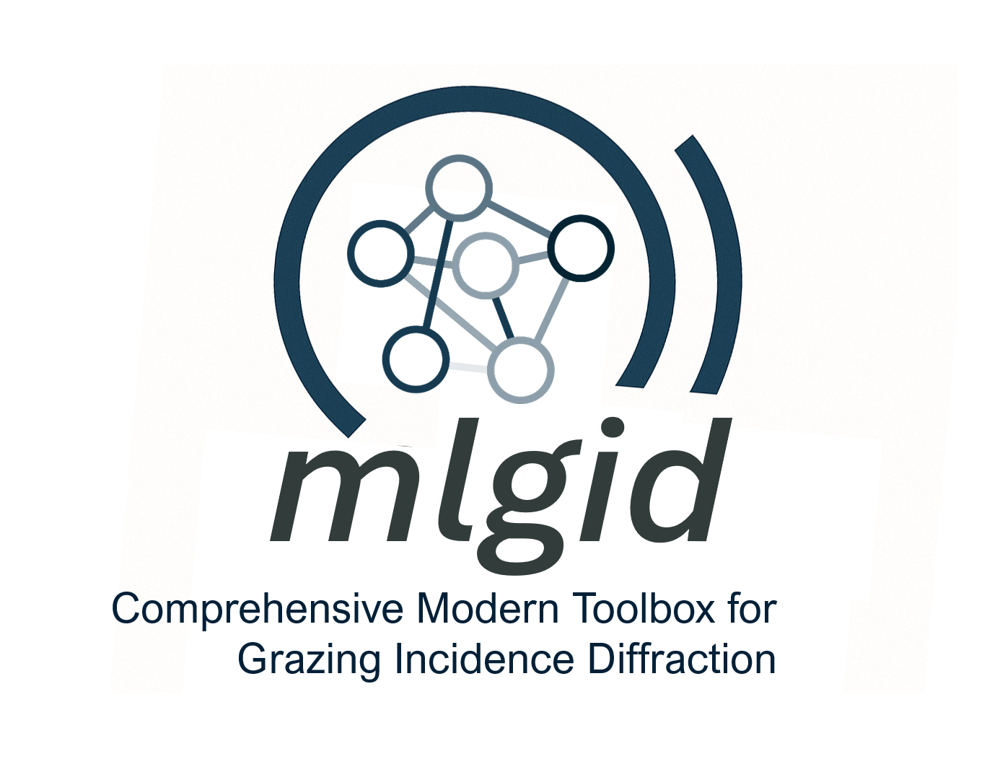

# mlgid-project

## A comprehensive modern toolbox for grazing-incidence diffraction (GID)

  

This project aims to implement a comprehensive set of tools for the standardization and automation of GID data processing. The packages can be used separately or combined together in the pipeline. 

> As a convention, packages that rely on machine learning start with `ml`, while other packages (such as those for conversion to reciprocal space and conventional peak fitting) start with `py`.

[comment]: # Feedback from the community:
[comment]: # > It is a big and beautiful pipeline, folks, and everybody loves it. (requested anonymity)

# Available packages

## [pygid](https://github.com/mlgid-project/pygid) - converts raw GID data to reciprocal space.

## [mlgidGUI](https://github.com/mlgid-project/mlgidGUI) - provides graphical user interface for annotating GID data.

## [pygidSIM](https://github.com/mlgid-project/pygidSIM) - simulates synthetic GID data from crystal structures.

---

# Publications

The following is the list of papers related to the _mlgid_ project.

  
<strong>List of papers</strong>

### ML-based peak detection and structure refinement

_Tracking perovskite crystallization via deep learning-based feature detection on 2D X-ray scattering data_

V. Starostin, V. Munteanu, A. Greco, E. Kneschaurek, A. Pleli, F. Bertram, A. Gerlach, A. Hinderhofer, and F. Schreiber. npj Comput. Mater. 8, 101 (2022) [https://doi.org/10.1038/s41524-022-00778-8](https://doi.org/10.1038/s41524-022-00778-8)

### Deployment at synchrotron facilities for real-time analysis

_End-to-end deep learning pipeline for real-time processing of
surface scattering data at synchrotron facilities_

V. Starostin, L. Pithan, A. Greco, V. Munteanu, A. Gerlach, A. Hinderhofer, and F. Schreiber. Synchrotron Radiat. News 35, 21-27 (2022) [https://doi.org/10.1080/08940886.2022.2112499](https://doi.org/10.1080/08940886.2022.2112499)

### Benchmarking peak detection

_Benchmarking deep learning for automated peak detection on GIWAXS data_

C. Völter, V. Starostin, D. Lapkin, V. Munteanu, M. Romodin, M. Hylinski, A. Gerlach, A. Hinderhofer, F. Schreiber. J. Appl. Crystallogr. 58, 513-522 (2025) [https://doi.org/10.1107/S1600576725000974](https://doi.org/10.1107/S1600576725000974)

